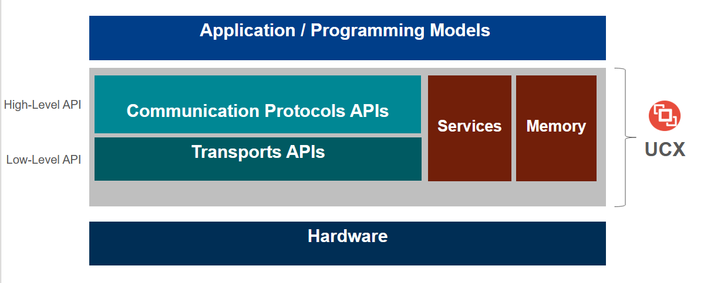

# UCX Tutorial at HotInterconnects 2022

**Held on**: August 19th, 9 AM - 12 PM US Pacific Time 

[Event website and Program](https://hoti.org/program/)

## Organizers:
* Jeffrey Young [(Georgia Institute of Technology)](https://crnch-rg.cc.gatech.edu/)
* Matthew Baker [(Voltron Data)](https://voltrondata.com/)
* Oscar Hernandez [(NVIDIA)](nvidia.com)
* Yossi Itigin [(NVIDIA)](nvidia.com)
* Chris Taylor [(Tactical Computing Laboratories)](https://tactcomplabs.com/)

**[NEW FOR 2022]** - Chris Taylor of [Tactical Computing Laboratories (TCL)](https://tactcomplabs.com/) will present on the newest UCX support for RISC-V platforms as well as ideas for growing UCX for the RISC-V ecosystem.

**Abstract:** Over the past 10 years, the Unified Communication X (UCX) framework has developed from an initial vision for a portable networking middleware layer to a fully implemented framework specification that supports multiple architectures including x86, Arm, Power and GPU. UCX provides a high-performance stacked architecture for communication runtimes like MPI and OpenSHMEM, and the definition of UCX protocol and transport layers continue to evolve with the introduction of new GPU supercomputers, edge computing devices, and smart networking cards. 

This tutorial covers some of the most recent advances around the UCX ecosystem and provides meaningful examples of the usage of UCX with MPI, OpenSHMEM, and as part of higher-level tools like NVIDIA's RAPIDS and Apache Spark. In addition to understanding the latest support for UCX layers, attendees will learn how to run simple examples of UCX codes that are relevant for Python developers with PyUCX, traditional MPI and SHMEM programmers.

Please register for Hot Interconnects to join this tutorial. Registration is free this year and includes access to the tutorials! [Register here](https://events.zoom.us/ev/Ag0YT5e-lTNl0GMOr_hTDXekOBRsWAKSLRqAlBY0X7Bzwubg3giw~Ail5D916DQK4hw0eT8Y9bI748fr6NFuIA0s9I6LmMGGmgR0z3u4XCqabrw)

## Agenda

**[Presentation slides](https://github.com/gt-crnch-rg/ucx-tutorial-hot-interconnects/blob/main/slides/UCX%202022%20HOTI%20Tutorial.pdf)**

| Time          | Topic                                   | Presenters     | 
| ------------- | --------------------------------------- | ------------- | 
| 9:00 - 9:20    | UCX Tutorial and Ecosystem Introduction | Oscar, Yossi | 
| 9:20 - 10:00   | UCX Basics - networking overview,       | Jeff    | 
|                | worker and endpoint creation            |              | 
| 10:00 - 10:10  | **BREAK**                               |               |
| 10:10 - 10:25  | Hello World Demo                        |  Matt  | 
| 10:25 - 10:40  | UCX memory management                   |  Jeff        | 
| 10:40 - 10:45  | Accelerators, UCXPy                     |  Oscar |
| 10:45 - 11:00  | GPU and UCXPy Hello World Demo          |  Matt  |
| 11:00 - 11:10  | **BREAK**                               |               |
| 11:10 - 11:25  | RISC-V Support for UCX                  |  Chris |
| 11:25 - 11:50  | UCX Advanced Topics - Bindings and         |  Yossi |
|                | OpenMPI integration                     |   | 

## Link to Tutorial Video

TBD - the session should be recorded and shared with attendees.

## Resources Mentioned in this Tutorial

### UCF/UCX Resources
* [UCF Website](www.openucx.org)
* [UCX Github](https://github.com/openucx/ucx)
* [UCX Mailing List](https://elist.ornl.gov/mailman/listinfo/ucx-group)
* [UCF ISC 2021 Birds of Feather Overview](https://openucx.org/wp-content/uploads/2021/07/UCF-UCX-BOF-ISC-2021.pdf)

### UCX Bindings
* [UCX-Py ReadTheDocs](https://ucx-py.readthedocs.io/en/latest/)
* [UCX Integration with DASK](https://blog.dask.org/2019/06/09/ucx-dgx)

## Acknowledgments
* We appreciate and acknowledge support from UCF members and collaborators including Pavel Shamis, Alina Sklarevich, Alex Margolis, Swen Boehm, and Oded Paz​
* This work was supported by the United States Department of Defense and used resources at Oak Ridge National Laboratory.
* This tutorial is funded in part by NSF CNS #2016701, "Rogues Gallery: A Community Research Infrastructure for Post-Moore Computing".

## Previous Iterations of this Tutorial
* [Hot Interconnects 2021 UCX Tutorial](https://github.com/gt-crnch-rg/ucx-tutorial-hot-interconnects/tree/v2021.8)
* [UCX 2017 Tutorial](https://openucx.org/presentations/) - this tutoral by Pavel Shamis may be available on the UCX presentations site. 
