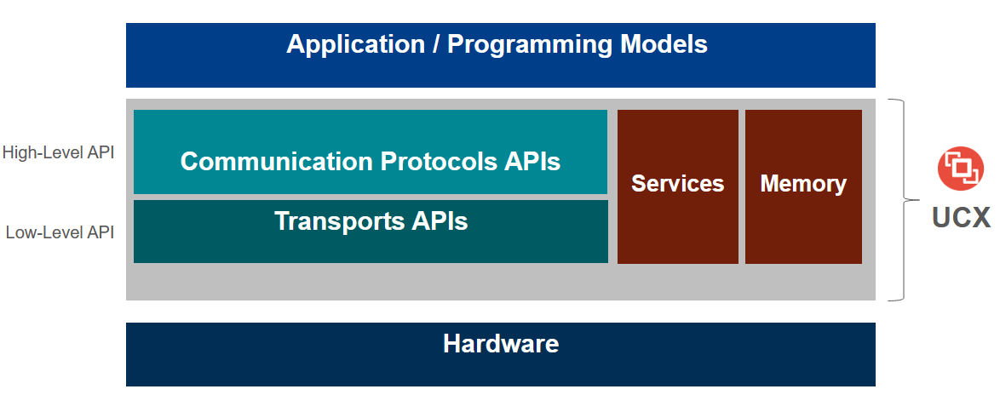

# UCX Tutorial at HotInterconnects 2021

**Held on**: August 20th, 9 AM - 12 PM US Pacific Time 

[Event website and Program](https://hoti.org/program.html)

## Organizers:
* Oscar Hernandez (NVIDIA)
* Jeffrey Young (Georgia Institute of Technology)
* Matthew Baker (Oak Ridge National Laboratory)
* Gilad Shainer (NVIDIA)
* Yossi Itigin (NVIDIA) 

Over the past 10 years, the Unified Communication X (UCX) framework has developed from an initial vision for a portable networking middleware layer to a fully implemented framework specification that supports multiple architectures including x86, Arm, Power and GPU. UCX provides a high-performance stacked architecture for communication runtimes like MPI and OpenSHMEM, and the definition of UCX protocol and transport layers continue to evolve with the introduction of new GPU supercomputers, edge computing devices, and smart networking cards. 

This tutorial covers some of the most recent advances around the UCX ecosystem and provides meaningful examples of the usage of UCX with MPI, OpenSHMEM, and as part of higher-level tools like NVIDIA's RAPIDS and Apache Spark. In addition to understanding the latest support for UCX layers, attendees will learn how to run simple examples of UCX codes that are relevant for Python developers with PyUCX, traditional MPI and SHMEM programmers.

Please register for Hot Interconnects to join this tutorial. Registration is free this year and includes access to the tutorials! [Register here](https://hoti.123signup.com/event/registration/kjxzx)

## Agenda

| Time          | Topic                                   | Presenters     | Slides | Notes |
| ------------- | --------------------------------------- | ------------- | ------ | ----- |
| 9:00 - 9:20    | UCX Tutorial and Ecosystem Introduction | Gilad |        |       |
| 9:20 - 10:00   | UCX Basics - networking overview,       | Jeff    |        |       |
|                | worker and endpoint creation            |              |        |       |
| 10:00 - 10:10  | **BREAK**                               |               |        |       |
| 10:10 - 10:20  | Hello World part 1                      |  Matt, Jeff  |        |       |
| 10:20 - 10:35  | UCX memory management                   |  Jeff, Oscar        |        |       |
| 10:35 - 10:45  | Hello World Demo, part 2                |  Matt, Jeff   |        |       |
| 10:45 - 11:00  | GPU discussion/demo                     |  Oscar, Matt  |        |       |
| 11:00 - 11:10  | **BREAK**                               |               |        |       |
| 11:10 - 11:50  | UCX Advanced Topics - bindings,         |  Matt, Yossi, Oscar |        |       |
|                | OpenMPI and OpenSHMEM integration       |   |        |       |

## Link to Tutorial Video

HotInterconnecst has hosted this tutorial video on their platform and on YouTube for this tutorial. See it [here](https://www.youtube.com/watch?v=QJIgAGZayUA).

## Resources Mentioned in this Tutorial

### UCF/UCX Resources
* [UCF Website](www.openucx.org)
* [UCX Github](https://github.com/openucx/ucx)
* [UCX Mailing List](https://elist.ornl.gov/mailman/listinfo/ucx-group)
* [UCF ISC 2021 Birds of Feather Overview](https://openucx.org/wp-content/uploads/2021/07/UCF-UCX-BOF-ISC-2021.pdf)

### UCX Bindings
* [UCX-Py ReadTheDocs](https://ucx-py.readthedocs.io/en/latest/)
* [UCX Integration with DASK](https://blog.dask.org/2019/06/09/ucx-dgx)

## Acknowledgments
* We appreciate and acknowledge support from UCF members and collaborators including Pavel Shamis, Alina Sklarevich, Alex Margolis, Swen Boehm, and Oded Paz​
* This work was supported by the United States Department of Defense & used resources at Oak Ridge National Laboratory.
* This tutorial is funded in part by NSF CNS #2016701, "Rogues Gallery: A Community Research Infrastructure for Post-Moore Computing".

